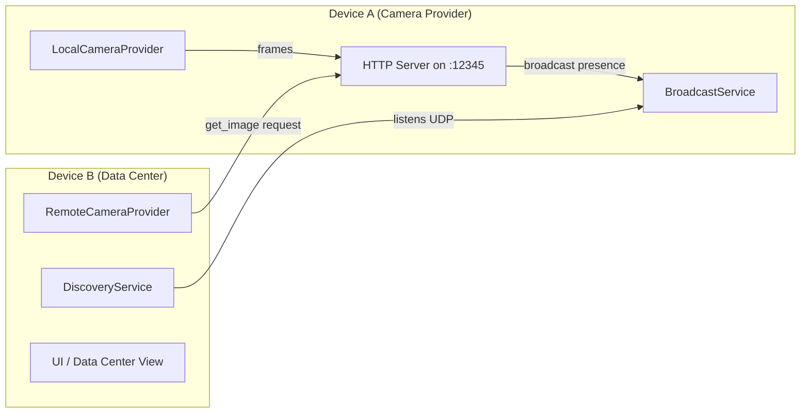
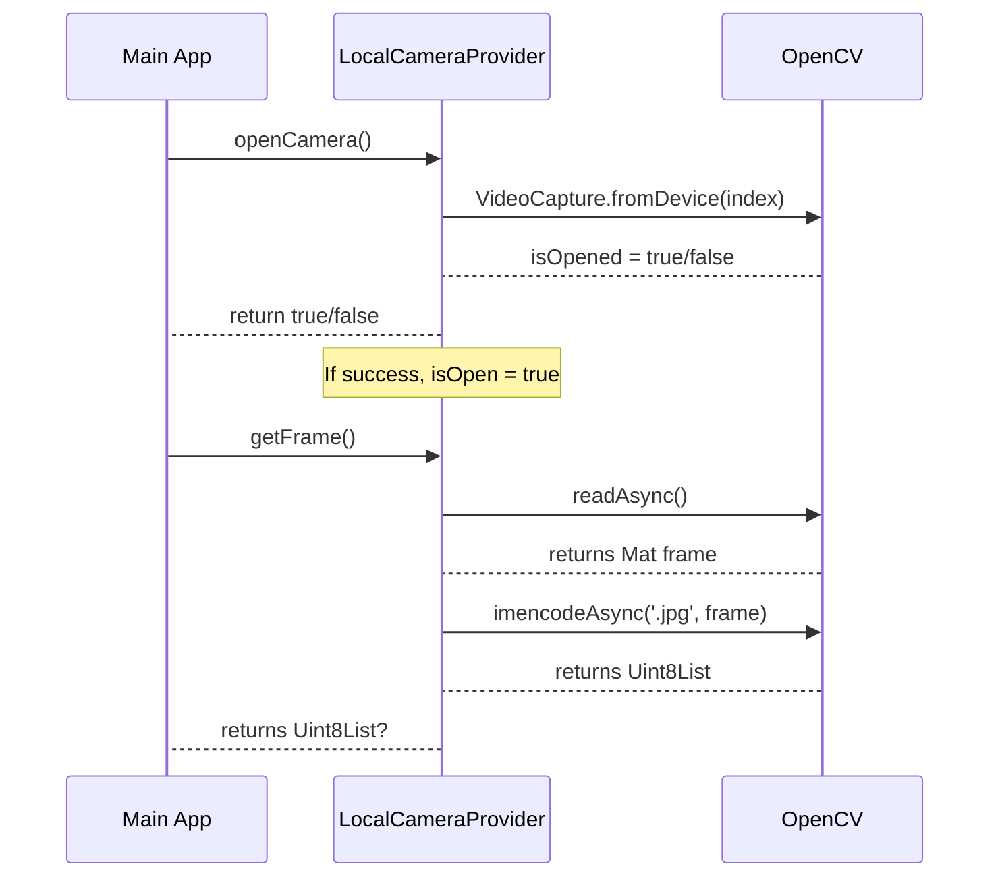
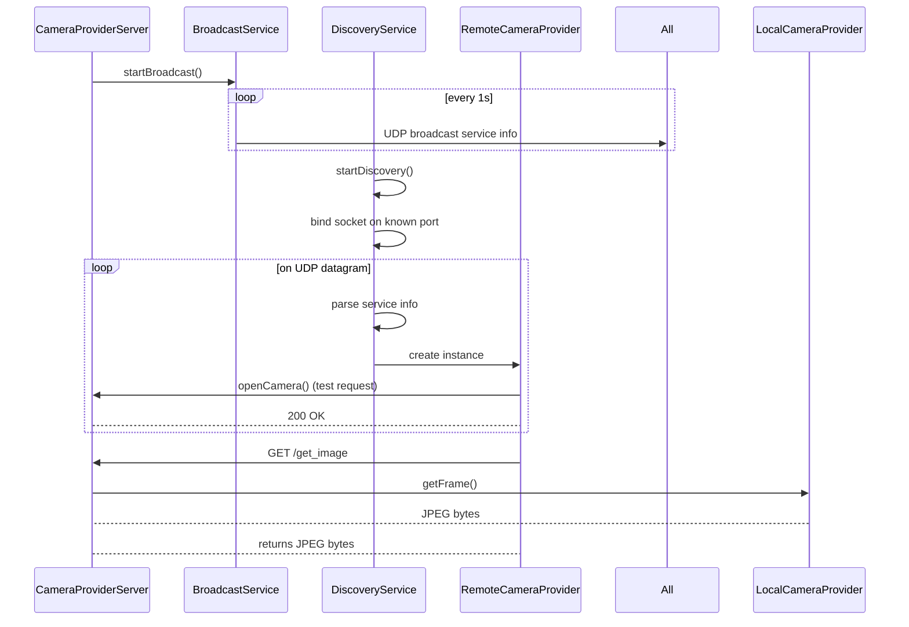

# Camera Provider & Discovery Architecture

This document describes the architecture of a system that enables:

1. Local camera usage (through `LocalCameraProvider`).
2. Remote camera usage (through `RemoteCameraProvider`).
3. Network-based discovery of cameras (using broadcasting with `BroadcastService` and scanning with `DiscoveryService`).
4. A Data Center to collect frames from discovered remote cameras.

Below is an overview of how these components work together, followed by diagrams and notes on potential improvements and additional features.

---

## Table of Contents

1. [System Overview](#system-overview)
2. [High-Level Architecture](#high-level-architecture)
3. [Key Components](#key-components)
   - [Camera Providers](#camera-providers)
   - [Discovery Services](#discovery-services)
   - [Data Center](#data-center)
   - [Logging](#logging)
4. [Sequence Diagrams](#sequence-diagrams)
   - [Local Camera Workflow](#local-camera-workflow)
   - [Remote Camera & Discovery Workflow](#remote-camera--discovery-workflow)
5. [Points to Improve](#points-to-improve)
6. [Potential Features to Add](#potential-features-to-add)

---

## System Overview

The system allows you to run a camera provider server on a device (e.g., a phone or Raspberry Pi) that captures frames locally and serves them via an HTTP endpoint (`/get_image`). At the same time, it advertises its existence on the network via broadcast (UDP-based). Another device acting as a "Data Center" can listen for these broadcasts using `DiscoveryService`, connect to each discovered camera, and receive frames from them remotely.

**Key features**:

- **Local camera capture** using OpenCV (via `opencv_dart`).
- **Remote camera capture** over HTTP from another device running the camera provider.
- **Broadcast and Discovery** to detect cameras in the local network without manual configuration.
- **Logging** for debugging interactions in real-time.

---

## High-Level Architecture

1. **Device A** hosts the camera provider and captures frames from a local camera.
2. It advertises itself to the network with a broadcast service (`BroadcastService`).
3. **Device B** starts a discovery process (`DiscoveryService`) to receive broadcasted service info.
4. Upon finding a camera provider, it creates a `RemoteCameraProvider` that fetches frames from Device A.
5. The Data Center UI displays frames from all discovered camera providers.

---

## Key Components

### 1. Camera Providers

**Interfaces & Providers:**

- **`ICameraProvider`**: The interface that both local and remote providers implement.

  - `openCamera()`, `closeCamera()`, `getFrame()`, `isOpen`.

- **`LocalCameraProvider`**:

  - Uses OpenCV to open a local camera device by index.
  - Captures frames, encodes them as JPEG, and returns `Uint8List`.

- **`RemoteCameraProvider`**:
  - Connects to a remote HTTP server for frames.
  - Sends HTTP requests to `/get_image` and returns the response as `Uint8List`.

### 2. Discovery Services

- **`BroadcastService`**:

  - Runs on the camera provider side.
  - Broadcasts service metadata (such as service name, type, port) to `255.255.255.255` at a set interval.
  - Allows other devices to discover it without manual IP configuration.

- **`DiscoveryService`**:
  - Runs on the Data Center side.
  - Listens on a known port for broadcasted service info.
  - Parses the metadata, builds a list of discovered services, and notifies listeners.

### 3. Data Center

- **Acts as a manager** for multiple remote camera providers:
  - Starts `DiscoveryService` to find cameras on the network.
  - For each discovered camera, spawns a `RemoteCameraProvider`.
  - Displays all camera feeds in a grid or list.

### 4. Logging

- **`RequestLogs`** and `ListNotifier`:
  - Central location to store system logs (particularly used by the camera provider HTTP server).
  - Real-time UI updates whenever logs change.

---

## Sequence Diagrams

### Local Camera Workflow

1. **`openCamera()`** requests the camera device via OpenCV.
2. On success, `isOpen` is set to `true`.
3. **`getFrame()`** reads a frame, encodes it to JPEG, and returns a `Uint8List`.

---

### Remote Camera & Discovery Workflow

1. **Camera Provider** starts broadcasting using `BroadcastService`.
2. **Data Center** starts discovery listening on the same port.
3. **DiscoveryService** receives broadcast packets, parses them, and identifies new services.
4. For each new service, a **`RemoteCameraProvider`** is instantiated to open the remote camera.
5. On a GET request to `/get_image`, the remote camera server fetches the local frame and responds with JPEG bytes.

---

## Points to Improve

1. **Security & Authentication**
   - Currently, there is no authentication or encryption in place for remote connections. Implementing HTTPS or token-based auth can secure the camera feed.
2. **Robust Error Handling**
   - In the event of repeated failures to open or read a camera, the system might loop infinitely or cause memory leaks. More robust error handling and resource cleanup can help.
3. **Configuration Management**
   - Some settings (like camera index, discovery interval, broadcast interval) are hardcoded. Externalizing these into config files or environment variables would make the system more flexible.
4. **Scalability**
   - The broadcasting approach works well for smaller networks, but large networks might face broadcast storm issues. Consider switching to a more structured discovery approach (like mDNS/Bonjour or a directory service) for larger deployments.
5. **Better Session Control**
   - Currently, the `RemoteCameraProvider` simply tests connectivity on `openCamera()`. Additional logic (like ping, keep-alive, timeouts) would ensure a more resilient connection.

---

## Potential Features to Add

1. **Face Recognition / Attendance**
   - The code includes face detection and extraction services. A next step could be real-time face recognition for automated attendance or security checks.
2. **Multi-Camera Sync**
   - Provide time synchronization or near real-time clock alignment if multiple camera feeds need to be correlated.
3. **Advanced Discovery**
   - Integrate with standard service discovery protocols (mDNS, SSDP, or Bonjour) to reduce the need for manual port setting.
4. **Mobile UI**
   - Build dedicated mobile-friendly UI to manage the camera feeds, start/stop discovery, and handle logs in a user-friendly manner.
5. **Recording & Playback**
   - Optionally record streams and store them on the Data Center device. Provide a timeline to review recorded footage.
6. **Camera Control**
   - Implement PTZ (Pan-Tilt-Zoom) commands if the camera hardware supports it. This would require additional endpoints or extension of the existing API.
7. **Cloud Upload**
   - Provide an option to forward frames or recognized faces to a cloud service for further analytics or storage.

---

## Conclusion

This system demonstrates a modular, easily extendable approach to camera capture (both local and remote), real-time broadcast-based discovery, and a data center concept for aggregating feeds.

**Key Takeaways**:

- Simple local/remote camera abstraction thanks to `ICameraProvider`.
- Broadcast & discover architecture for seamless detection of camera servers.
- Extendable face detection & comparison modules that can serve advanced analytics use-cases.

By addressing the points for improvement and adding the suggested features, this architecture can be scaled and enhanced to support more robust, secure, and feature-rich camera applications.
