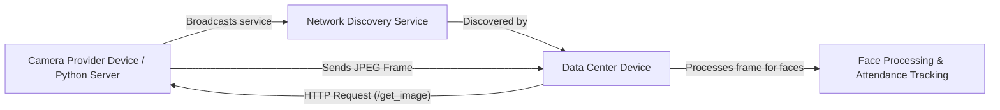

# Automated Attendance System

Welcome to the Automated Attendance System! This application allows you to either share your device’s camera as a **Camera Provider** or run a **Data Center** that discovers and uses these camera feeds to detect and recognize faces for attendance tracking.

Additionally, if you prefer not to run the full interface on your device, you can run a lightweight Python server as your image provider.

---

## Overview

The system works in two main modes:

- **Camera Provider Mode:**  
  Your device’s camera captures video frames. The app processes these frames (using face detection techniques) and then broadcasts your camera service over your local network. Other devices (Data Centers) can discover your device and request a snapshot (JPEG image) when needed.

- **Data Center Mode:**  
  This mode automatically discovers available Camera Providers on your network. It polls these providers to get the latest image frames, processes them to detect faces, and then displays recognized faces and attendance logs.

**Alternate Option:**  
If you prefer a simpler setup, you can run a dedicated Python server as your Camera Provider. This server exposes the same `/get_image` HTTP endpoint to serve camera images without the full application interface.

All communication between devices is done over your local network via simple HTTP requests.

---

## How It Works (Simplified)

1. **Camera Provider Mode:**
   - **Capture & Process:** The app accesses your camera, captures frames, and (if needed) processes them into JPEG images.
   - **Broadcast:** It then “announces” itself on the network so that other devices can find it.
   - **Serve Frames:** When a Data Center sends an HTTP request (to `/get_image`), your device sends back the latest image frame.

2. **Data Center Mode:**
   - **Discover Providers:** The system uses a discovery service to find all available Camera Providers.
   - **Poll & Process:** It periodically sends an HTTP request to each provider’s `/get_image` endpoint. When a frame is received, it is processed (using isolates if enabled) to detect faces.
   - **Track Attendance:** Detected faces are compared, tracked over time, and the recognized faces are displayed in the app.

3. **Python Server Option:**
   - **Lightweight Provider:** If you prefer not to run the full Camera Provider interface, you can run a dedicated Python server. This server serves JPEG images via the `/get_image` endpoint.
   - **Same Endpoint:** The Data Center interacts with the Python server exactly as it does with the full Camera Provider—no additional configuration is needed.

---

## Diagram of the System

Below is a simplified diagram that illustrates the overall communication:



*Note: Whether you use the full Camera Provider app or the Python server option, the Data Center interacts with them using the same HTTP endpoint.*

---

## Installation

### For the Flutter App

1. **Prerequisites:**
   - Install [Flutter](https://flutter.dev/docs/get-started/install) on your system.
   - Ensure you have a working device or emulator.

2. **Clone the Repository:**
   ```bash
   git clone https://github.com/abdelaziz-mahdy/automated-attendance.git
   cd automated-attendance
   ```

3. **Install Dependencies:**
   ```bash
   flutter pub get
   ```

4. **Run the App:**
   - **On a Device/Emulator:**
     ```bash
     flutter run
     ```

### For the Python Server

1. **Prerequisites:**
   - Make sure you have Python 3 installed on your system.
   - Install any required dependencies (listed in requirements file).

2. **Run the Setup Script:**
   - In the Python server directory, execute the setup script:
     ```bash
     ./setup.sh
     ```
   - This script will install the necessary Python packages and 'uv' and run the server.


---

## User Instructions

### Launching the App

When you start the Flutter application, you will be greeted with a **Mode Selection Screen**:

- **Start as Camera Provider:**  
  Choose this option if you want your device’s camera to broadcast its feed on the network.

- **Start as Data Center:**  
  Choose this option if you want to discover available camera feeds and see real-time face recognition and attendance information.

### Using Camera Provider Mode

- **Permissions:**  
  The app will request permission to access your camera. Please allow it.
  
- **Broadcasting:**  
  Once activated, your device will automatically broadcast its service on your local network. Data Centers will be able to discover your camera feed.

- **Status:**  
  On-screen logs or messages will indicate that the server is running and frames are being captured.

### Using Data Center Mode

- **Discovery:**  
  The Data Center mode searches your local network for available Camera Providers. When one is found, it is listed on the screen.
  
- **Live Feed & Processing:**  
  The Data Center polls each discovered provider for the latest frame. It displays the frame along with current frame rate (FPS) and face detection results.
  
- **Recognized Faces:**  
  Detected faces are processed and compared. Recognized faces are shown in the “People” section, where you can also assign names to tracked faces.

- **Settings:**  
  In Data Center mode, you can adjust settings such as:
  - **Max Faces in Memory:** The number of face thumbnails to store.
  - **Use Isolates:** Enable background isolates for frame processing to improve performance.

### Using the Python Server Option

If you prefer a simpler setup without running the full Flutter interface:

- **Setup:**  
  Follow the Python server installation steps above.
  
- **Run the Server:**  
  Start the Python server, which will expose the `/get_image` HTTP endpoint.
  
- **Integration:**  
  The Data Center mode will automatically discover and interact with the Python server just as it does with the full Camera Provider app.

---

## Troubleshooting

- **No Camera Feed?**
  - Ensure your device has a working camera.
  - Verify that camera permissions are granted.
  - Check that your device is connected to the same local network as the Data Center device.

- **Data Center Not Discovering Providers?**
  - Confirm that either the Camera Provider mode or Python server is active.
  - Ensure both devices are on the same network.
  - Restart the discovery service if necessary.

- **Performance Issues?**
  - Try toggling the “Use Isolates” setting in Data Center mode.
  - Review the logs for error messages.

---

## Summary

- **Camera Provider Mode:** Your device captures and serves camera frames.
- **Data Center Mode:** Your device discovers camera feeds, processes frames to detect faces, and tracks attendance.
- **Python Server Option:** Run a lightweight Python server as a simple image provider if you prefer not to run the full interface.

We hope this guide helps you understand and use the Automated Attendance System with ease. Enjoy a smarter way to manage attendance with real-time face recognition!

