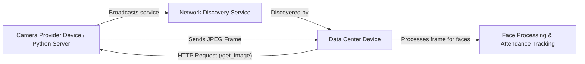

Below is an updated README with an extra section explaining that if you don’t want to run the full interface, you can run the Python server as a lightweight image provider.

---

# Automated Attendance System

Welcome to the Automated Attendance System! This application allows you to either share your device’s camera as a **Camera Provider** or run a **Data Center** that discovers and uses these camera feeds to detect and recognize faces for attendance tracking.

## Overview

The system works in two main modes:

- **Camera Provider Mode:**  
  Your device’s camera captures video frames. The app processes these frames (using face detection techniques) and then broadcasts your camera service over your local network. Other devices (Data Centers) can discover your device and request a snapshot (JPEG image) when needed.

- **Data Center Mode:**  
  This mode automatically discovers available Camera Providers on your network. It polls these providers to get the latest image frames, processes them to detect faces, and then displays recognized faces and attendance logs.

**Alternate Option:**  
If you prefer not to run the full interface on your device, you can instead run a lightweight Python server as your image provider. This Python server exposes the same `/get_image` HTTP endpoint to serve camera images without the full application interface.

All communication between devices is done over your local network via simple HTTP requests.

## How It Works (Simplified)

1. **Camera Provider Mode:**
   - **Capture & Process:** The app accesses your camera, captures frames, and (if needed) processes them to a JPEG image.
   - **Broadcast:** It then “announces” itself on the network so that other devices can find it.
   - **Serve Frames:** When a Data Center sends an HTTP request (to `/get_image`), your device sends back the latest image frame.

2. **Data Center Mode:**
   - **Discover Providers:** The system uses a discovery service to find all available Camera Providers.
   - **Poll & Process:** It periodically sends an HTTP request to each provider’s `/get_image` endpoint. When a frame is received, it is processed (using isolates if enabled) to detect faces.
   - **Track Attendance:** Detected faces are compared, tracked over time, and the recognized faces are displayed in the app.

3. **Python Server Option:**
   - If you prefer a simpler setup, you can run a dedicated Python server that acts as your Camera Provider. This server will serve JPEG images via the `/get_image` endpoint without the need to run the full user interface.
   - This is ideal for lightweight deployments or if you wish to integrate the image provider into another system without the full Flutter-based UI.

## Diagram of the System

Below is a simplified diagram that illustrates the overall communication:

*Note: Whether you use the full Camera Provider app or the Python server option, the Data Center interacts with them using the same HTTP endpoint.*

## User Instructions

### Getting Started

1. **Installation:**
   - Follow the installation instructions provided with your app package (or check the installation guide in the project documentation).

2. **Launching the App:**
   - When you start the application, you will be greeted with a **Mode Selection Screen**:
     - **Start as Camera Provider:**  
       Choose this option if you want your device’s camera to broadcast its feed on the network.
     - **Start as Data Center:**  
       Choose this option if you want to discover available camera feeds and see real-time face recognition and attendance information.

### Using Camera Provider Mode

- **Permissions:**  
  When you choose Camera Provider mode, the app will request permission to access your camera. Please allow it.
  
- **Broadcasting:**  
  Once the camera is activated, your device will automatically broadcast its service on your local network. Other Data Centers will be able to find your camera feed.

- **Status:**  
  A log screen (or on-screen message) will indicate that the server is running and frames are being captured.

### Using Data Center Mode

- **Discovery:**  
  The Data Center mode will search your local network for available Camera Providers. When one is found, it will be listed on the screen.
  
- **Live Feed & Processing:**  
  The Data Center will periodically poll each discovered provider. It displays the latest frame along with the current frame rate (FPS) and processed face detections.
  
- **Recognized Faces:**  
  Detected faces are processed and compared. Recognized faces are displayed in the “People” section, where you can also assign names to tracked faces.

- **Settings:**  
  In Data Center mode, you can adjust settings like:
  - **Max Faces in Memory:** Set how many face thumbnails to store.
  - **Use Isolates:** Toggle the use of background isolates for frame processing (this can help improve performance on multi-core devices).

### Using the Python Server Option

If you don’t want to run the full Camera Provider interface:
  
- **Setup:**  
  Install the provided Python server (instructions are available in the Python server documentation).

- **Run the Server:**  
  Start the Python server on your device. It will serve images via the `/get_image` endpoint in the same way as the full Camera Provider does.
  
- **Integration:**  
  The Data Center mode will discover and interact with the Python server exactly as it does with the full Camera Provider. No additional configuration is needed.

### Troubleshooting

- **No Camera Feed?**  
  - Make sure your device has a working camera.
  - Verify that camera permissions are granted.
  - Check that your device is connected to the same local network as the Data Center device.

- **Data Center Not Discovering Providers?**  
  - Ensure that the Camera Provider mode or Python server is active on a device.
  - Verify that both devices are on the same network.
  - Restart the discovery service by toggling the mode or checking your network settings.

- **Performance Issues?**  
  - Try adjusting the “Use Isolates” setting in Data Center mode.
  - Check the logs for any error messages.

## Summary

- **Camera Provider Mode:** Your device captures and serves camera frames.
- **Data Center Mode:** Your device discovers camera feeds, processes frames to detect faces, and helps track attendance.
- **Python Server Option:** For a simpler setup, run the Python server as a lightweight image provider without the full user interface.

We hope this guide helps you understand and use the Automated Attendance System with ease. Enjoy a smarter way to manage attendance with real-time face recognition!
